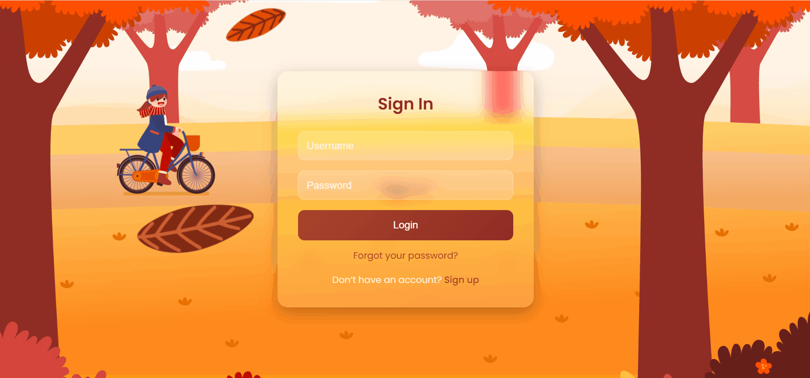

# 🌿 Animated Glassmorphism Login Page

A modern **Login / Sign Up UI** built with **Glassmorphism design** and smooth **CSS animations**.  
This project showcases creative front-end design techniques with falling leaves, animated characters, and layered backgrounds.

---

## 🚀 Live Demo
👉 [View Project on GitHub Pages](https://ryanaxondev.github.io/animated-glassmorphism-login/)

---

## 📸 Preview


---

## ✨ Features

- 🎨 **Glassmorphism design** with blur and transparency effects  
- 🍂 **Falling leaves animation** for a natural, dynamic background  
- 🚴 **Animated character (girl on a bicycle)** moving across the scene  
- 🌲 Layered **background, ground, and trees** with depth  
- 🔐 **Authentication forms**:  
  - Sign In (Login)  
  - Sign Up (Register)  
- 📱 **Responsive layout** that adapts to different screen sizes  
- ⚡ Lightweight implementation with **vanilla HTML, CSS, and JS**  

---

## 📂 Project Structure

```
.
├── index.html       # Main HTML file
├── style.css        # Styling and animations
├── main.js          # JavaScript for form toggle logic
└── images/          # Assets (background, leaves, girl, ground, trees, demo.gif)
```

---

## 🚀 Getting Started

1. **Clone the repository**

   ```
   git clone https://github.com/ryanaxondev/animated-glassmorphism-login.git
   ```

2. **Navigate to the project folder**

   ```
   cd animated-glassmorphism-login
   ```

3. **Open in browser**
   Simply open `index.html` in your browser.
   *(No build tools required — pure HTML, CSS, and JS!)*

---

## 🛠 Built With

* **HTML5** – semantic structure
* **CSS3** – animations, glassmorphism, responsive design
* **Vanilla JavaScript** – simple form toggle logic

---

## 🤝 Contributing

Contributions, issues, and feature requests are welcome!
Feel free to **fork this repo** and submit a pull request.

---

## 📜 License

This project is released under the **MIT License**.
You are free to use, modify, and distribute it.

---

⭐ If you like this project, consider giving it a **star** on GitHub!
